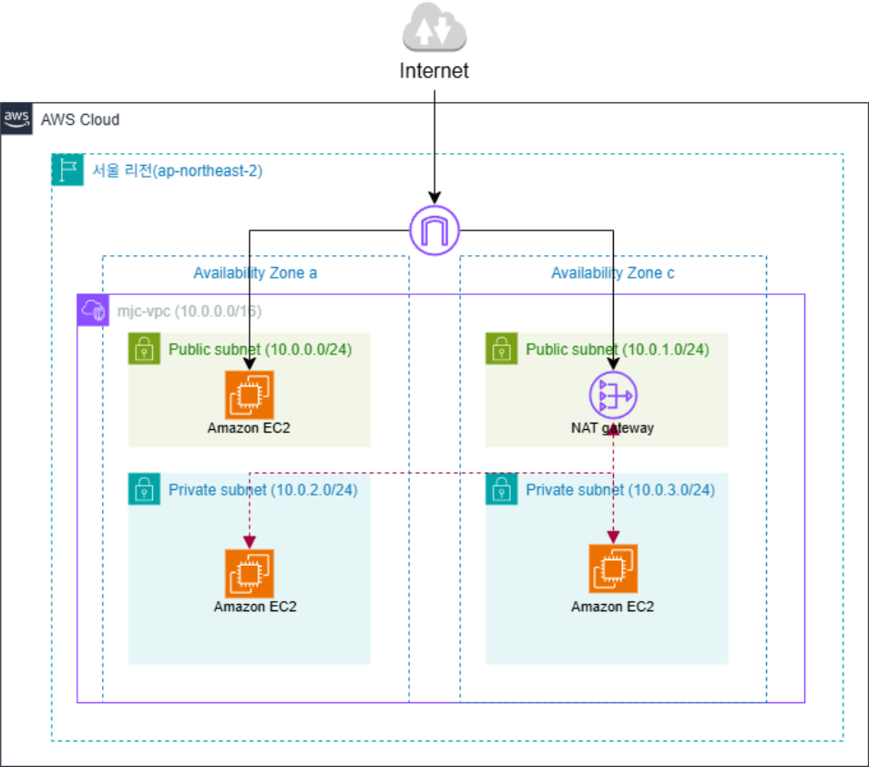

# AWS Network Infrastructure Project

> AWS VPC 기반 Public/Private 네트워크 분리 설계 및 Bastion Host를 통한 프라이빗 인스턴스 접근 구현

<br>

## 개요

| 항목 | 내용 |
|------|------|
| **기간** | 2026.03 |
| **유형** | 개인 프로젝트 |
| **리전** | 서울 (ap-northeast-2) |
| **목적** | Public/Private 서브넷 분리 기반 보안 네트워크 설계 및 Bastion Host를 통한 프라이빗 인스턴스 접근 구현 |

<br>

## 프로젝트 배경 및 목표

### 배경

| 구분 | On-Premise | AWS |
|------|-----------|-----|
| 초기 비용 | 막대한 선투자 필요 | 초기 선투자 없음 |
| 유지보수 | 높은 인건비 | 운영비용 절감 |
| 확장성 | 경직된 자원 할당 | 탄력적 운영 및 확장 가능 |

### 목표
- Public/Private 서브넷 분리를 통한 네트워크 보안 체계 구축
- Bastion Host + NAT Gateway 조합으로 안전한 프라이빗 통신 환경 구현

<br>

## 아키텍처 구성도



### 트래픽 흐름
- **외부 → Bastion Host**: 인터넷 → IGW → Public Subnet → mjc-public-inst (SSH)
- **Bastion → Private EC2**: mjc-public-inst → Private Subnet (SSH)
- **Private EC2 → 외부**: Private Subnet → NAT GW → IGW → 인터넷

<br>

## 생성 리소스 목록

| 리소스 | 이름 | 비고 |
|--------|------|------|
| VPC | mjc-vpc | 10.0.0.0/16 |
| Public Subnet 1 | mjc-public-subnet-1 | 10.0.0.0/24 (ap-northeast-2a) |
| Public Subnet 2 | mjc-public-subnet-2 | 10.0.1.0/24 (ap-northeast-2c) |
| Private Subnet 1 | mjc-private-subnet-1 | 10.0.2.0/24 (ap-northeast-2a) |
| Private Subnet 2 | mjc-private-subnet-2 | 10.0.3.0/24 (ap-northeast-2c) |
| Internet Gateway | mjc-igw | VPC에 연결 |
| NAT Gateway | mjc-natgw | EIP 할당, 2c 배치 |
| Public Route Table | mjc-public-rt | 0.0.0.0/0 → IGW |
| Private Route Table | mjc-private-rt | 0.0.0.0/0 → NAT GW |
| Security Group | mjc-sg | SSH 인바운드 허용 |
| EC2 (Public) | mjc-public-inst | Bastion Host |
| EC2 (Private 1) | mjc-private-inst-1 | 10.0.2.68 (2a) |
| EC2 (Private 2) | mjc-private-inst-2 | 10.0.3.217 (2c) |

<br>

## 구성 순서

1. [VPC 생성](#1-vpc-생성)
2. [서브넷 생성](#2-서브넷-생성)
3. [인터넷 게이트웨이 생성](#3-인터넷-게이트웨이-생성)
4. [NAT 게이트웨이 생성](#4-nat-게이트웨이-생성)
5. [라우팅 테이블 구성](#5-라우팅-테이블-구성)
6. [보안 그룹 생성](#6-보안-그룹-생성)
7. [EC2 인스턴스 배포](#7-ec2-인스턴스-배포)
8. [Bastion Host 연결](#8-bastion-host-연결)

<br>

---

## 1. VPC 생성

```
이름: mjc-vpc
IPv4 CIDR: 10.0.0.0/16
```

<br>

---

## 2. 서브넷 생성

```
# Public Subnet
mjc-public-subnet-1   | 10.0.0.0/24  | ap-northeast-2a
mjc-public-subnet-2   | 10.0.1.0/24  | ap-northeast-2c

# Private Subnet
mjc-private-subnet-1  | 10.0.2.0/24  | ap-northeast-2a
mjc-private-subnet-2  | 10.0.3.0/24  | ap-northeast-2c
```

<br>

---

## 3. 인터넷 게이트웨이 생성

```
이름: mjc-igw
연결: mjc-vpc에 연결 (VPC에 연결 → mjc-vpc 선택)
```

> IGW는 VPC와 인터넷 사이 통신을 가능하게 하는 수평 확장, 고가용성 컴포넌트

<br>

---

## 4. NAT 게이트웨이 생성

```
이름: mjc-natgw
서브넷: mjc-public-subnet-2 (2c)
탄력적 IP: EIP 신규 할당
```

> NAT GW는 프라이빗 서브넷의 EC2가 인터넷에 아웃바운드 접근할 수 있도록 IP를 변환

<br>

---

## 5. 라우팅 테이블 구성

### Public Route Table
```
이름: mjc-public-rt
라우팅: 0.0.0.0/0 → mjc-igw
서브넷 연결: mjc-public-subnet-1, mjc-public-subnet-2
```

### Private Route Table
```
이름: mjc-private-rt
라우팅: 0.0.0.0/0 → mjc-natgw
서브넷 연결: mjc-private-subnet-1, mjc-private-subnet-2
```

<br>

---

## 6. 보안 그룹 생성

```
이름: mjc-sg
VPC: mjc-vpc
인바운드 규칙: SSH (포트 22) - 접속 허용
```

<br>

---

## 7. EC2 인스턴스 배포

### Bastion Host (Public)

```
이름: mjc-public-inst
AMI: Amazon Linux 2023
인스턴스 유형: t3.micro
키 페어: mjc-kpair (RSA, .pem)
VPC: mjc-vpc
서브넷: mjc-public-subnet-1 (2a)
퍼블릭 IP 자동 할당: 활성화
보안 그룹: mjc-sg
```

### Private EC2 1

```
이름: mjc-private-inst-1
AMI: Amazon Linux 2023
인스턴스 유형: t3.micro
키 페어: mjc-kpair (RSA, .pem)
VPC: mjc-vpc
서브넷: mjc-private-subnet-1 (2a)   → 10.0.2.68
퍼블릭 IP 자동 할당: 비활성화
보안 그룹: mjc-sg
```

### Private EC2 2

```
이름: mjc-private-inst-2
AMI: Amazon Linux 2023
인스턴스 유형: t3.micro
키 페어: mjc-kpair (RSA, .pem)
VPC: mjc-vpc
서브넷: mjc-private-subnet-2 (2c)   → 10.0.3.217
퍼블릭 IP 자동 할당: 비활성화
보안 그룹: mjc-sg
```

<br>

---

## 8. Bastion Host 연결

### 8-1. Xshell로 Bastion Host 접속

```
호스트: 43.203.202.190 (mjc-public-inst 퍼블릭 IP)
사용자 이름: ec2-user
인증 방법: Public Key
키 페어: mjc-kpair.pem
```

### 8-2. Bastion → Private EC2 SSH 접속

```bash
# Bastion Host에서 Private EC2 접속
# mjc-kpair.pem 파일을 Bastion Host로 전송 후 실행

# Private EC2-1 접속
ssh -i "mjc-kpair.pem" ec2-user@10.0.2.68

# Private EC2-2 접속
ssh -i "mjc-kpair.pem" ec2-user@10.0.3.217
```

> Private EC2는 퍼블릭 IP가 없으므로 직접 접속 불가. Bastion Host를 경유해야만 접근 가능

<br>

---

## 검증 결과

```
# Bastion Host → Private EC2-1 접속 성공
[ec2-user@ip-10-0-0-65 ~]$ ssh -i "mjc-kpair.pem" ec2-user@10.0.2.68
[ec2-user@ip-10-0-2-68 ~]$  ← 접속 성공

# Bastion Host → Private EC2-2 접속 성공
[ec2-user@ip-10-0-0-65 ~]$ ssh -i "mjc-kpair.pem" ec2-user@10.0.3.217
[ec2-user@ip-10-0-3-217 ~]$  ← 접속 성공
```

<br>

---
